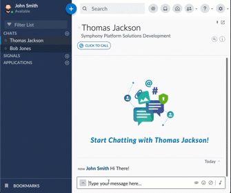

## Click-to-Call Example App
This extension app adds a button to user profiles and 1-to-1 IMs to integrate with third-party telephony systems



## Configuration
### Add Application into AC Portal
1. Go to AC Portal > App Management
2. Add Custom App
3. Fill in details and note the APP ID for later
4. Generate RSA key pair and fill in public key
5. Go to AC Portal > App Settings
6. Find the newly-created app and enable it, then make it visible

### Populate configuration files
##### src/main/resources/config.json
* Replace ``appId`` value with ``APP ID`` from step 3
* Replace private key path/name with location of generated key pair from step 4
````json5
{
    // ...
    "appId": "click-to-call",
    "appPrivateKeyPath": "rsa/",
    "appPrivateKeyName": "rsa-private.pem"
}
````

##### src/main/resources/static/bundle.json
* Replace ``id`` value with ``APP ID`` from step 3
````json5
{
  "applications": [
    {
      // ...
      "id": "click-to-call",
      // ...
    }
  ]
}
````

##### src/main/resources/static/js/controller.js
* Replace ``appId`` value with ``APP ID`` from step 3
````javascript
{ appId: 'click-to-call', tokenA: appToken }
````

### Development Testing
1. Refresh maven dependencies and run/debug the Spring Boot project
2. Head to https://[your-pod].symphony.com/client/index.html?bundle=https://localhost:4000/bundle.json
3. Go to Symphony Market and install Click to Call
4. Note that you will see 2 entries as 1 of them is the one installed in the pod, which is used for app authentication, and the other one is the one injected by the bundle in step 2 above
5. You might need to remove/add from Symphony Market in between code changes. To avoid this, you can rename the app name and id in your project's ``bundle.json`` temporarily during development time. 

### Third-party Telephony Integration
1. Open ``src/main/resources/static/js/controller.js``
2. Replace the line below this ``TODO`` with your own implementation
   * ``// TODO: Implement integration with third-party telephony API here``
